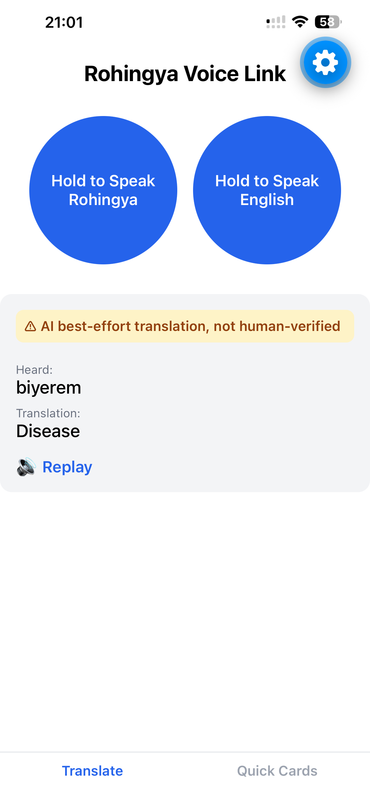

# Rohingya Voice Link — MVP

Bidirectional Rohingya↔English voice translator, plus a phrasebook of TWB-verified
emergency/medical terms. See `TECHNICAL_JOURNAL.md` for the full architecture and
model-choice reasoning (Meta's MMS project support Rohingya, and that's
what this is built on).

## Demo



🎥 [Watch the demo video](demo/app_demo.mov)

First screen you land on is **Quick Cards**, basically a little dictionary of
English ↔ Rohingya words. Then I hold down **"Hold to Speak Rohingya"** and say
"Biaram", and it reads back "Disease" in English. **"Hold to Speak English"** does the
same thing in reverse (speak English, hear it back in Rohingya). That direction
works too, but in this clip it errors out on recording because my Colab GPU quota
ran out mid-demo. Will update the clip once that resets (~a day).

## 1. Quick Start & Prerequisites

- **Node.js** — no global Expo CLI needed, everything runs via `npx`.
- **Python 3.9+**
- **Hugging Face account + access token** (`Read` role is enough) —
  https://huggingface.co/settings/tokens
- **ngrok account + authtoken** (free tier) —
  https://dashboard.ngrok.com/get-started/your-authtoken
- **Gemini API key** (free tier, not OpenAI) — https://aistudio.google.com/apikey
- **Google Colab access with a T4 GPU runtime** — the two Rohingya-specific models
  run here; your local machine doesn't need a GPU.
- **Expo Go** on your phone (App Store / Play Store).

FFmpeg is **not** a separate requirement — `faster-whisper`'s PyAV dependency ships
its own decoder libraries.

## 2. Environment Variables

**Backend** — copy `backend/.env.example` to `backend/.env`:

| Variable | Description |
|---|---|
| `MODEL_SERVER_URL` | ngrok URL printed by the Colab notebook (§3); changes on every restart |
| `GEMINI_API_KEY` | From https://aistudio.google.com/apikey |
| `WHISPER_MODEL_SIZE` | Local English ASR size, default `base` |

**Mobile** — no `.env`; it's a plain constant. Edit `mobile/src/config.ts`:
```ts
export const BACKEND_URL = "http://<your-mac-LAN-IP>:8080";
```
(`localhost` won't work from a phone.) Find your IP with `ipconfig getifaddr en0`.

## 3. Colab Model Server Setup

Set this up first — the backend depends on it.

1. https://colab.research.google.com → **File → Upload notebook** → pick
   `colab/mms_model_server.ipynb`. (Colab can't see this repo on its own; no GitHub
   needed.) Optionally **File → Save a copy in Drive** to persist it.
2. **Runtime → Change runtime type → T4 GPU → Save.**
3. Accept model terms if prompted, at https://huggingface.co/facebook/mms-1b-all and
   https://huggingface.co/facebook/mms-tts-rhg.
4. Optional: click the **🔑 key icon** in the sidebar, add `HF_TOKEN` and
   `NGROK_TOKEN` as Colab Secrets (toggle "Notebook access" on). Only works from the
   actual Colab website — via VS Code's "Select Kernel → Colab" (same real GPU,
   different front end), Secrets time out and the notebook falls back to a hidden
   `getpass` prompt automatically.
5. Run all cells top to bottom. **Never paste a token as the literal argument to
   `getpass.getpass("...")`** — that's just the prompt label; the secret goes in the
   hidden input box that appears when the cell runs, or it ends up saved in plaintext.
6. Last cell prints a public `https://*.ngrok-free.app` URL — that's `MODEL_SERVER_URL`.

If the runtime disconnects (idle timeout, going offline), everything — models,
installs, tunnel — is gone. Reconnect with a fresh kernel and re-run all cells.

## 4. Backend Setup

```bash
cd backend
python3 -m venv .venv && source .venv/bin/activate
pip install -r requirements.txt
cp .env.example .env   # fill in MODEL_SERVER_URL and GEMINI_API_KEY
uvicorn app.main:app --host 0.0.0.0 --port 8080 --reload
```

To log to a file as well (useful for debugging):
```bash
uvicorn app.main:app --host 0.0.0.0 --port 8080 --reload 2>&1 | tee backend.log
```

## 5. Mobile Setup

```bash
cd mobile
npm install
npx expo start --tunnel
# scan the QR code with Expo Go
```

`--tunnel` beats default LAN mode here — routes through a public relay instead of
needing direct phone↔Mac reachability, sidestepping router isolation/firewall
issues. Slower to load, far more reliable. Dev setup only (Expo Go) — no EAS build.

## 6. Core Features & App Usage Guide

Two tabs, bottom tab bar.

**Translate** (default): two buttons, **"Hold to Speak Rohingya"** and **"Hold to
Speak English"** — press, hold, speak, release. Shows what it heard and the
translation, auto-plays the result (🔊 Replay to repeat). A yellow **"⚠ AI
best-effort translation, not human-verified"** banner means it came from the Gemini
fallback, not the phrasebook — treat with extra caution, especially anything medical.

**Quick Cards**: the 31-entry TWB phrasebook. Tap to hear it spoken — real audio if
available, else synthesized from the verified transcript. Never touches the LLM
fallback, so no hallucination risk here by construction.

## 7. API Reference

Base URL: your `BACKEND_URL` (`http://<LAN-IP>:8080`).

**`GET /health`** — backend status + Colab reachability check.
```json
{ "backend": "ok", "model_server": { "status": "ok", "device": "cuda" } }
```

**`GET /phrases`** — full phrasebook array (`id`, `category`, `english`,
`rohingya_latin`, `rohingya_bangla`, `audio_url`, `verified`).

**`POST /synthesize`** — synthesize Rohingya speech for a verified phrase with no
pre-recorded audio.
```json
// request  { "text": "Biaram" }
// response { "audio_base64": "..." }
```

**`POST /translate-speech`** — the core endpoint, one route for both directions
(distinguished by `direction`, not two separate routes — same response shape either
way, simpler client).

`multipart/form-data`: `file` (audio), `direction` (`"rhg2en"` | `"en2rhg"`).
```json
{
  "input_text": "what the ASR heard",
  "output_text": "the translated text",
  "source": "glossary" | "llm",
  "verified": true | false,
  "audio_base64": "..."
}
```
`verified: false` = Gemini fallback, not the TWB glossary — surface this to the user.

## 8. Known Limitations

- **Unverified translation outside the phrasebook** — no open-source NMT model
  supports Rohingya (`TECHNICAL_JOURNAL.md` §3); Gemini fallback always flagged
  `verified: false`.
- Phrasebook is medical/COVID only (31 entries), no market/everyday phrases yet —
  see `data/SOURCES.md`.
- No offline mode — backend and Colab tunnel must both be reachable.
- No noise suppression on recordings.
- No automated test suite yet.
- Colab sessions disconnect on idle/offline; ngrok URL changes on every restart —
  update `backend/.env` accordingly.
